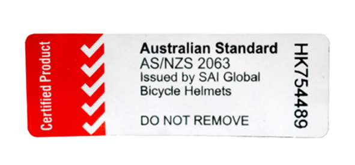

## A helmet for every child

We recommend a helmet for every student, so nobody's waiting around for someone else's to come free. At the start of a project, schools usually fit and name each helmet (think "Sam W" written on the side) and keep them in classrooms, ready for the next ride.

When students move on, their helmets go back into circulation. Heads grow, though, so expect to size some kids up over time.

Some schools run a shared pool instead: around 100 helmets in mixed sizes, stored with the bike fleet. It works, but means more sorting before each session.

## Choosing helmets

Look for helmets that meet the AS/NZS 2063 standard and check for the certification sticker before you buy. Easy-adjust straps make fitting faster, especially with a whole class waiting.

A couple of examples of what's out there:

### Ride9 supplied helmet

- EPS foam construction, lightweight outer shell
- Available sizes:
  - XXS–XS (47–53cm)
  - S–M (54–58cm)
  - M–L (58–62cm)

### Avanti supplied helmet

- Bell Crest Junior, fusion in-mould polycarbonate shell
- Sizes:
  - universal youth (50–57cm)
  - universal adult (54–61cm)

## Check your helmet

Helmets only protect what they're sitting on properly. Three quick checks, easy enough for any class to learn:

1. Two fingers above your eyebrow: your helmet should just touch your top finger.
2. Make a V shape with two fingers and slide it under your ears: the straps should sit firm against your fingers.
3. One finger under the chin strap: it should feel firm there too.

If anyone has a crash (especially a knock to the head), tell an adult straight away.

[More on fitting a helmet correctly](https://at.govt.nz/cycling-walking/bikes-gear/cycling-gear/check-and-fit-your-helmet)

## Approximate cost

100 helmets (a mix of sizes) typically costs around **$2,000**.
